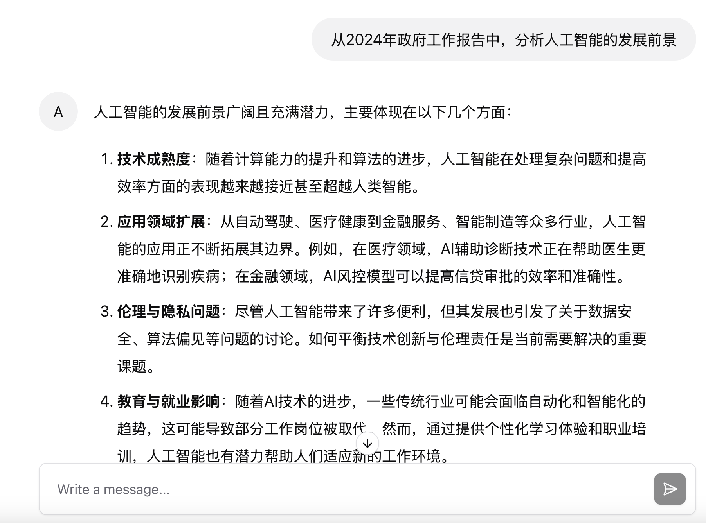

# Spring AI 实现朴素 RAG

Naive RAG using Spring AI. Load content from web pages.

## 运行

需要在本地安装 Docker Desktop。使用 Docker Desktop 来运行
Pgvector。参考 `docker-compose.yaml` 文件。

默认使用通义千问 2.5 0.5b 模型（`qwen2.5:0.5b`），可以通过配置文件来修改。

> 朴素 RAG 的结果，依赖于文档相似性的查询结果。在本地运行时，受限于模型的参数数量，查询结果可能不太准确。

访问 [Swagger UI](http://localhost:8080/swagger-ui/index.html) 来与 API 交互。

## 加载网页到向量数据库

发送 POST 请求到 `/etl/webpage`，提供网页 URL。

```json
{
  "url": "https://www.gov.cn/yaowen/liebiao/202403/content_6939153.htm"
}
```

## 与大模型交互

发送 POST 请求到 `/chat`，提供消息内容。

```json
{
  "input": "从2024年政府工作报告中，分析人工智能的发展前景"
}
```

通过用户界面进行交互，访问 http://localhost:8080/webjars/chat-agent-ui/index.html



## 课程

[](https://www.bilibili.com/cheese/play/ss15645)

《AI 大模型检索增强生成【Spring AI
实现】》课程已经上线，可以从 [B站](https://www.bilibili.com/cheese/play/ss15645)
或 [抖音](https://v.douyin.com/iF7jm8Nu/) 购买。